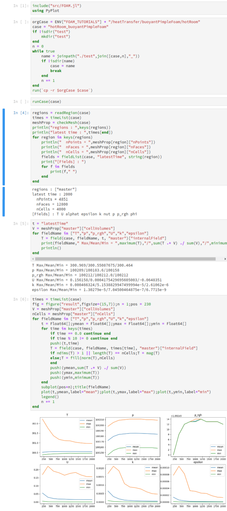

# OpenFOAM handler with using Julia

- Julia : v1.0.1
- OpenFOAM : v1806

```
#in python
pip install PyFoam

#in Julia
using Pkg

Pkg.add("IJulia")
Pkg.add("PyPlot")
Pkg.add("PyCall")
Pkg.add("DataStructures")
```
#Example


## Tasks

- __done__ read case dir
- __done__ read OpenFOAM dictFile
- __done__ read time
  - __done__ time list
  - field
	- __done__ dimensions
	- __done__ internalField
	- __ok__ boundaryField
- __ok__ read constant
  - __ok__ mesh
    - __done__ checkMesh
  - __done__ read regionProperties
- __ok__ read system
- parseDict without pyFoam
