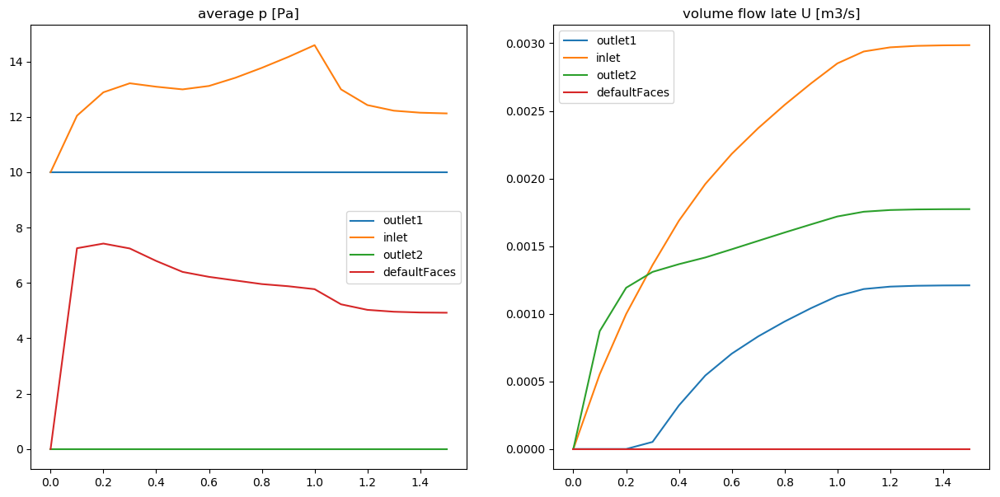

```julia
include("../src/FOAM.jl")
using PyPlot
```


```julia
orgCase = ENV["FOAM_TUTORIALS"] * "/incompressible/pimpleFoam/RAS/TJunction"
case = "Tjunction.pimpleFoam"
if !isdir("test")
    mkdir("test")
end
n = 0
while true
    name = joinpath("test",join([case,n],"_"))
    if !isdir(name)
        case = name
        break
    end
    n += 1
end
run(`cp -r $orgCase $case`)
runCase(case)
```

    Running blockMesh on /home/inabower/OpenFOAM/inabower-v1806/run/FOAM.jl/example/test/Tjunction.pimpleFoam_0
    Running pimpleFoam on /home/inabower/OpenFOAM/inabower-v1806/run/FOAM.jl/example/test/Tjunction.pimpleFoam_0


```julia
times = timeList(case)
meshProp = meshProperties(case)
checkMesh(meshProp)
```

    For region master
      nPoints = 5616
      nFaces = 13200
      nCells = 3875
     Face Area
      Min = 1.5999999999999806e-5
      Max = 1.600000000000003e-5
     Volume
      Min = 6.39999999999988e-8
      Max = 6.400000000000041e-8
      Total = 0.0002480000000000001
     Bounding Box
      Min = [0.0, -0.21, 0.0]
      Max = [0.22, 0.21, 0.02]
     Fields : 
      U epsilon k nut p phi s 
     For Boundary outlet1
        surface area : 0.0003999999999999997 (vec) : [0.0, -0.0004, 0.0]
     For Boundary inlet
        surface area : 0.00040000000000000013 (vec) : [-0.0004, 0.0, 0.0]
     For Boundary outlet2
        surface area : 0.00039999999999999975 (vec) : [0.0, 0.0004, 0.0]
     For Boundary defaultFaces
        surface area : 0.04920000000000133 (vec) : [0.0004, 1.49078e-18, 4.46895e-18]


```julia
fig = figure("result",figsize=(15,7));n = 1;pos = 120
x = Float64[]
for t in keys(times)
    push!(x,t)
end
for region in keys(meshProp["regions"])
    p = Dict()
    U = Dict()
    for t in keys(times)
        p[t] = field(case, "p", times[t], "master")
        U[t] = field(case, "U", times[t], "master")
    end
    for b in keys(meshProp[region]["boundary"])
        yp = Float64[]
        yu = Float64[]
        for t in keys(times)
            pp = boundaryField(p[t], meshProp[region], false)
            pU = boundaryField(U[t], meshProp[region], true)
            A = meshProp[region]["boundary"][b]["surfaceArea"]
            ppb = pp[b]
            pUb = pU[b]
            avep = 0.0
            sumU = 0.0
            for bi in 1:length(A)
                avep += ppb[bi] / length(A)
                sumU += norm(dot(pUb[bi], A[bi]))
            end
            push!(yp,avep)
            push!(yu,sumU)
        end
        subplot(pos+1);title("average p [Pa]")
        plot(x,yp,label=b)
        legend()
        subplot(pos+2);title("volume flow late U [m3/s]")
        plot(x,yu,label=b)
        legend()
    end
end        
```




