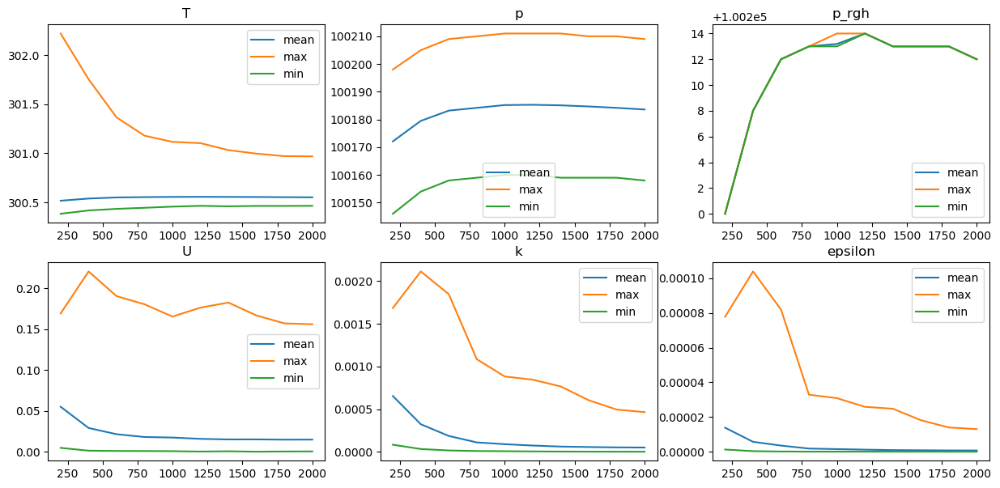

```julia
include("../src/FOAM.jl")
using PyPlot
```


```julia
orgCase = ENV["FOAM_TUTORIALS"] * "/heatTransfer/buoyantPimpleFoam/hotRoom"
case = "hotRoom_buoyantPimpleFoam"
if !isdir("test")
    mkdir("test")
end
n = 0
while true
    name = joinpath("./test",join([case,n],"_"))
    if !isdir(name)
        case = name
        break
    end
    n += 1
end
run(`cp -r $orgCase $case`)
runCase(case)
```

    Running blockMesh on /home/inabower/OpenFOAM/inabower-v1806/run/FOAM.jl/example/test/hotRoom_buoyantPimpleFoam_0
    Restore 0/ from 0.orig/
    Running setFields on /home/inabower/OpenFOAM/inabower-v1806/run/FOAM.jl/example/test/hotRoom_buoyantPimpleFoam_0
    Running buoyantPimpleFoam on /home/inabower/OpenFOAM/inabower-v1806/run/FOAM.jl/example/test/hotRoom_buoyantPimpleFoam_0


```julia
times = timeList(case)
meshProp = meshProperties(case)
checkMesh(meshProp)
```

    For region master
      nPoints = 4851
      nFaces = 12800
      nCells = 4000
     Face Area
      Min = 0.25
      Max = 0.25
     Volume
      Min = 0.125
      Max = 0.125
      Total = 500.0
     Bounding Box
      Min = [0.0, 0.0, 0.0]
      Max = [10.0, 5.0, 10.0]
     Fields : 
      T U alphat epsilon k nut p p_rgh phi 
     For Boundary floor
        surface area : 100.0 (vec) : [0.0, -100.0, 0.0]
     For Boundary fixedWalls
        surface area : 200.0 (vec) : [0.0, 0.0, 0.0]
     For Boundary ceiling
        surface area : 100.0 (vec) : [0.0, 100.0, 0.0]


```julia
t = "latestTime"
V = meshProp["master"]["cellVolumes"]
for fieldName in ["T","p","p_rgh","U","k","epsilon"]
    T = field(case, fieldName, t, "master")["internalField"]
    print(fieldName," Max/Mean/Min = ",maximum(T),"/",sum(T .* V) ./ sum(V),"/",minimum(T))
    println()
end
```

    T Max/Mean/Min = 300.969/300.55087675/300.464
    p Max/Mean/Min = 100209/100183.6/100158
    p_rgh Max/Mean/Min = 100212/100212.0/100212
    U Max/Mean/Min = 0.156158/0.0004175429695605003/-0.0648351
    k Max/Mean/Min = 0.000466324/5.1538829947499994e-5/2.61062e-6
    epsilon Max/Mean/Min = 1.30279e-5/7.04500464875e-7/6.7715e-9


```julia
times = timeList(case)
fig = figure("result",figsize=(15,7));n = 1;pos = 230
V = meshProp["master"]["cellVolumes"]
nCells = meshProp["master"]["nCells"]
for fieldName in ["T","p","p_rgh","U","k","epsilon"]
    t = Float64[];ymean = Float64[];ymax = Float64[];ymin = Float64[]
    for time in keys(times)
        if time == 0.0 continue end
        if time % 10 != 0 continue end
        push!(t,time)
        T = field(case, fieldName, times[time], "master")["internalField"]
        if ndims(T) > 1 || length(T) == nCells;T = mag(T)
        else;T = fill(norm(T),nCells)
        end
        push!(ymean,sum(T .* V) ./ sum(V))
        push!(ymax,maximum(T))
        push!(ymin,minimum(T))
    end
    subplot(pos+n);title(fieldName)
    plot(t,ymean,label="mean");plot(t,ymax,label="max");plot(t,ymin,label="min")
    legend()
    n += 1
end
```




